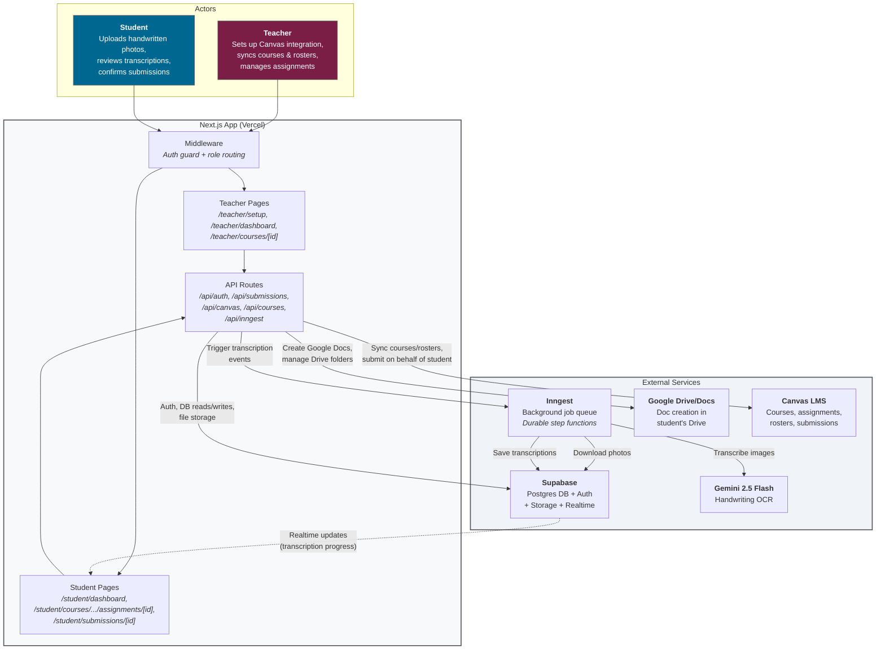
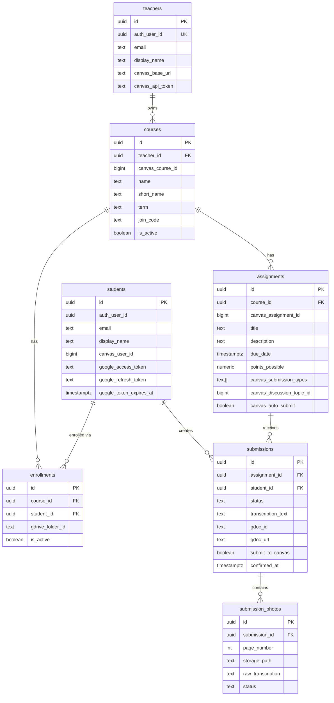
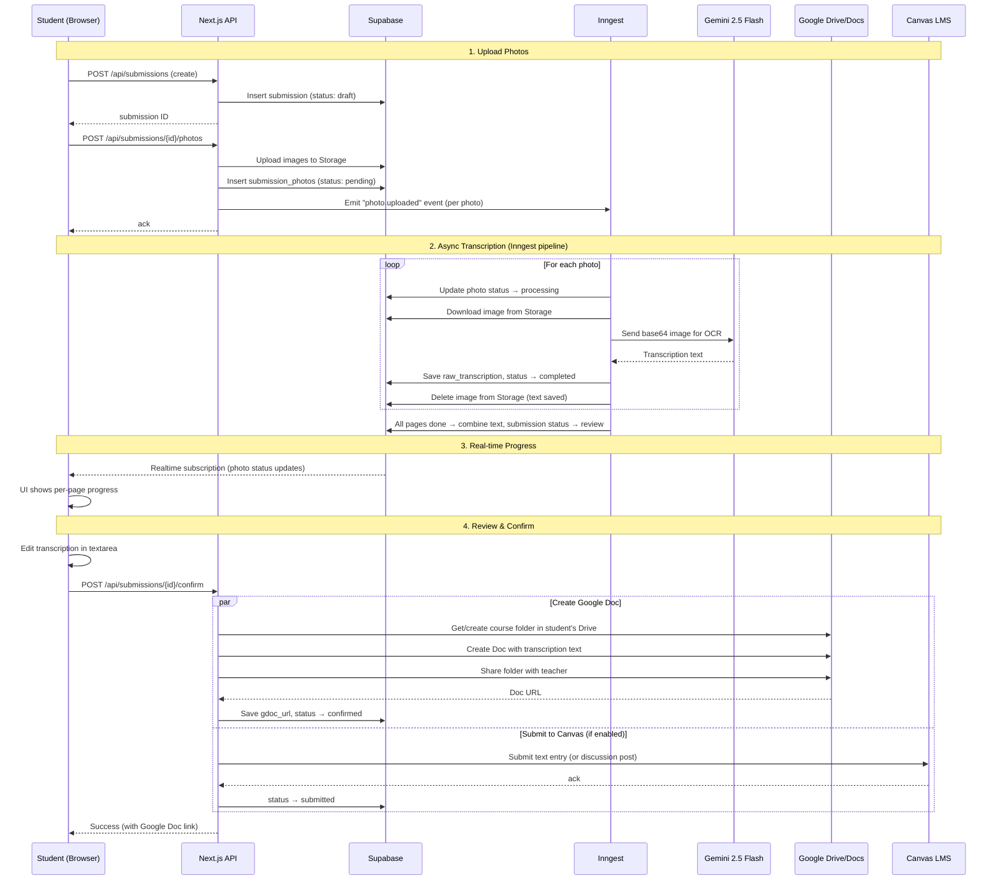
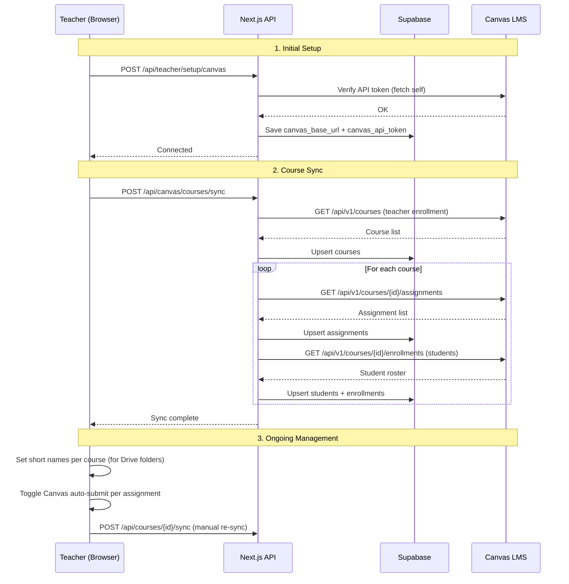
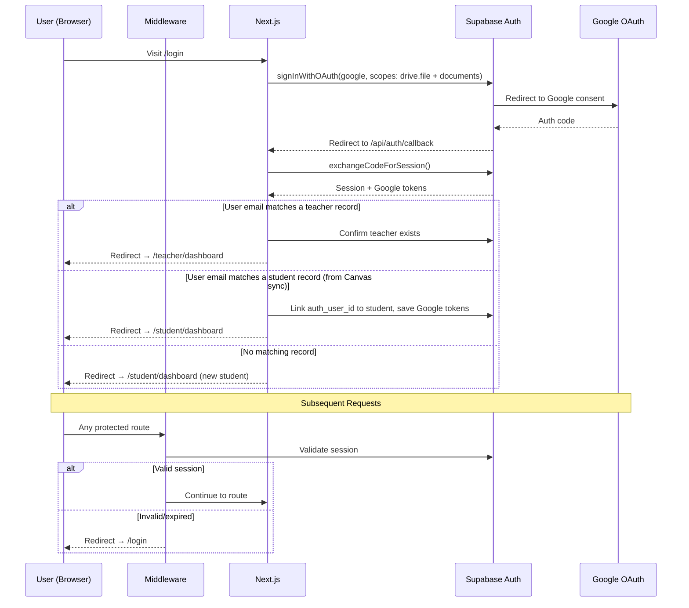

# Architecture

## System Overview

## Database Schema

## Student Submission Flow

This is the core flow — uploading handwritten work through to a finished Google Doc.

## Teacher Setup & Sync Flow

## Authentication Flow

